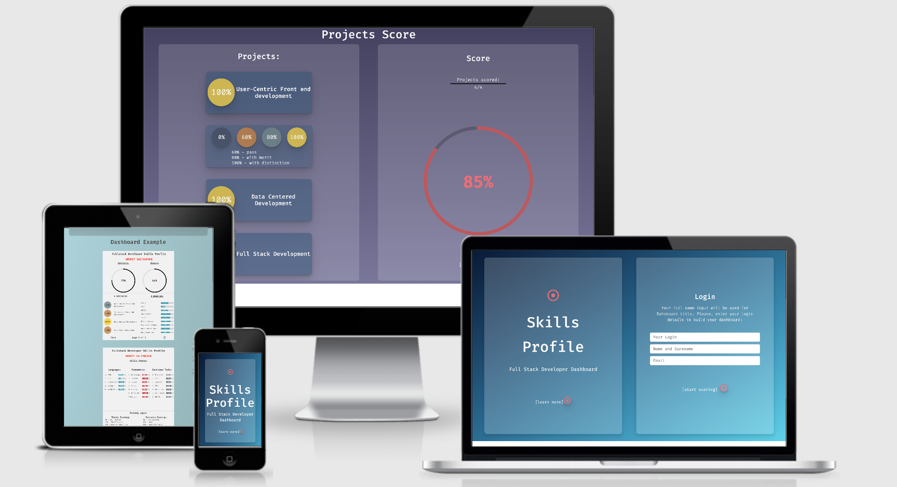
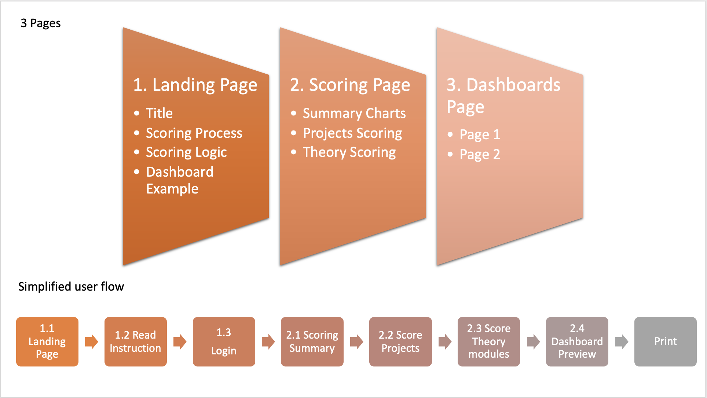
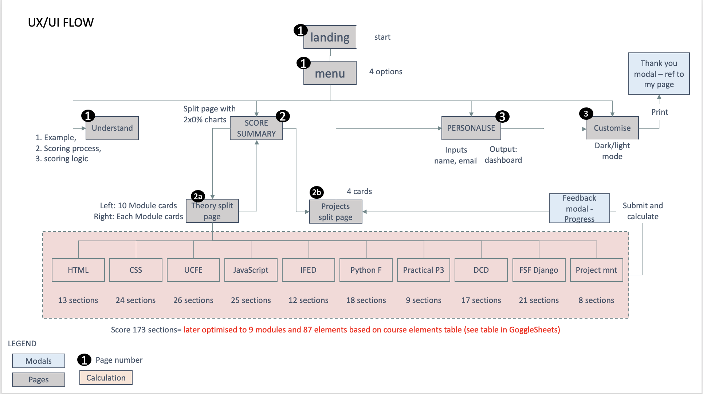
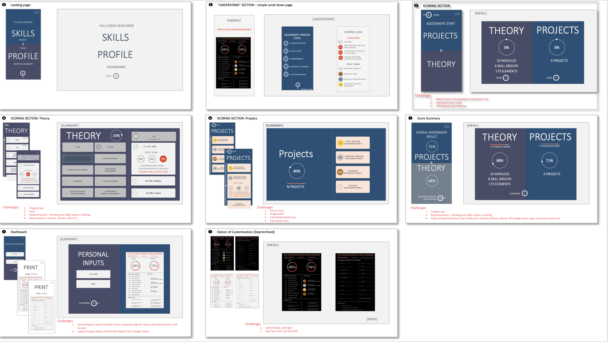

# FULL STACK DEVELOPER SKILLS PROFILE DASHBOARD

___

## SUMMARY
Project lnk: [Full Stack Skills Profile Dashboard](https://askfrsltn.github.io/skills_profile_dashboard/) 
This interactive application is developped based on Code Institute Full Sack Developer course. It is an interactive tool to collect scroing inputs for 4 projects and 87 theoretical elements to build an individual 2 pages skills profile dashboard consisting of 5 sections - Projects (4 projetcs), Theory (9 Theory modules), Languages (5 programing langusages), Frameworks (7 frameworks and libraries) and Other developers tools.
___

## Content 

Introduction
1. User Experience Design
2. User interface
3. Features
4. Development
5. Testing
6. Version Control
7. Deployment
8. Credits
9. Disclaimers

## Introduction
- This application iwas developed for Interactive front end development module (MS2 IFED) of Code Institue Full Stack development course. 
- It is a web based application for Full web stack developers and sudents. It helps to build and print visually appealing simple 2 pages of individual skills dashbaord using intercative scorecard interface for inputs and donut charts for output. 
- Skills structure was developed based on CodeInstitute course program. Profile assessement includes 2 domains - theoretical and practical. 
Scoring logic was partially developped by myself based on my previous consulting experience in carreer succession planning.

## 1. UX
#### 1.1	Goals
* **Developer Goals**
1. Clarify and build a logic of the skills that Full Stack Development course student will aquire after the course completion.
2. Identify developer skills that still need to be improved, especially from practical usage point of view.
3. Reinforce knowledge of Javascript, especially in the field of working with dashboards and connecting it to interactive visual design.
4. Learn new functionalities in Interactive Front-end such as canvas object and working with local storage.
5. Promote my FSD skills and knowledge in 2 differnet domains - application development and consulting.

* **User Goals**
1. Develop a nice looking personal Skills Profile document for a developer resume (send to email or print to a printer).
2. Clarify full scope of the skills required for Full Stack Developer
3. Identify the areas of expertise that require more attention to improve from practical point of view

#### 1.2	User Stories
This web-site is built for Full Stack Development **Students** and  **Developers** pursuing carreer in this field
* As a **beginner student** I want to undesrtand what I will learn during the course and set up a baseline using an assessment
* As a FSD **student** I want to undesrtand (a) What’s  is the full scope of skills I am dealing with and (b) which skills still need to be reinforced with practice 
* As a **Junior developer** I want to have a simple electronic dashboard with realistic assessement of my practical and theoretical knowledge use it during a job application process
* As a **qualified professional**  I want to understand quickly what assignments I can practically cope with as a developer, and which areas still need to be reinforced

#### 1.3 Strategy Plain
- **Goal** - develop application to help user develop skills profile document with simple and logical visual representation of acquired paractical and theoretical skills acquired during FSD course.

A major purpose of the application to be able to revisit all the elements learnt during FSD course and assess individual ability to apply the knowledge in practice, at work. It gives confidence to an applicant and understanding where to focus next.

#### 1.4 Scope Plain
- **Content** 
    - an app needs to have 3 pages - 1)landing/explanation and login, 2) Scoring Page with summary section 3) Final output preview - dashboard page
    - In order to structure the content correctly Full scope of FUll Stack Developer 9 modules was analysed and broken down into smaller elements (see the table in [GoogleSheets file](https://docs.google.com/spreadsheets/d/1SpufglcNxwii_YfiRx_VtilaV6URxorlfLOkcrcpS8o/edit?usp=sharing)). The elements will be used to build a structure of scorecards for Projects and Theory elements (see attachment) assessment. In simle word - 1 scoring element on the table will be represented by 1 scorecard on a page.
    - Standard Scoring Logic will be based on 3 choices both for projects and for theory. For Theory - this logic needs to be based on level of individual ability to aply certain study element in practice (60% - familiar, 80% - practially applied at least once during the projects,100% -  learnt and used on th eprojects up to the level when the assessor can teach others). For Projects - each project will have a score based on awarded mark (60% - pass, 80% - merit or 100%-disticntion)
    - A final output - dashboard pages should be visual with maximum 2 pages showing short visual summary of FullStack Developer skills by division on Projects, Theory, show % score for each project and 9 theoretiacl moules.
    - Thoeoretical elements on the final dashboard should also be alternatively grouped by 3 alternative criterea - "Developer Languages", "Frameworks/Liibraries" and "Developer tools"with appropriate grpahical representation.

- **Functionally**: 
    - Functionality of the apliaction has 4 goals - 1) Explain to a user the process and the scoring logic; 2) Suggest to a user the accurate scoring choices for Project and Theoretical elements 3) Visualise the scoring progress and scoring result during the scoring, and 4) Build 2 pages of individually customised dashboard.
    - EXPLANATION: an app should have simple Explanation section about what the application is, what it does does, how it works. It should have a dashboard example and scoring choices description for Project and Theory elements
    - INPUTS: an app needs to personalise dashbard therefore there should be a login page with 3 fields  - login, Full Name for dahsboard heading and an email. That will help to store the information into local storage
    - INPUTS: an app needs to provide simple 3-choice scoring functionaliy that can be  learnt intuitively and correctly applied during scoring process. Interactive scorecards should be used for interactive input. 
    - OUTPUT: Visual Representation of Theory and Projects overall score should be updated after each scoring choice. Donut chart will be the best choice for visualisation.
    - OUTPUT: Visual Representation of Asessment/Scoring Progress needs to be updated after each scoring choice in a form of vertical bar for Projects, Overall Theory progress and each module within theory section
    - OUTPUT: Each Scorecard needs to have interactive user functionality to demonstrate available scoring choices and indicate the status of scoring on each of the scorecards (Yes/No) after the choice has been made, so that user is able to immidiately see whether project or theory element is scored or not.

#### 1.5 Structure Plain
- The application is focused on functionality, therefore its interactivity has a single purpose of helping user to build Full Stack Developer Skills Dashboard without destractive decorations.

- **Features Prioritisation** 
    - List of features to prioritise and status:
        - **Logical course structure** - to build calculation logic foundation - priority No1, planning started with it.
        - **Visual Charts** - prirority feature - key focus of the site - scorepage and dashboard page
        - **Scorecards** - prirority feature on the scorecard page
        - **Local Storage** - priority feature for scorepage and dashboard page
        - **Description** - prirority feature for landing page
        - **Login** - prirority feature for landing page, it helps to store information into local storage
        - **Calculation logic** - absolutely critical prirority feature
        - **Description of the scoring logic** - prirority feature on the landing/understanding page. 
        - **Buttons** - prirority feature to navigate between pages and scoring sections
        - **Limited intuitive navigation between pages** - priority feature
        - **Scoring Progress calculation** - priority feature on the scoring sections, immidiately shows to the user how far s/he is from the finish.
        - Personalisation with Name - priority feature - dashboard page wokrs based on login page data inputs
        - **Date stamp** - priority feature on dashboard page
        - **Option to score data in the local storage** forever and linking it to login data so that it can be retrieved evry time the user returns to the website - partialy implemented on a scorpage and dashboard page, though is not built to store user data forever
        - **Modals with warnings** - priority feature across the site to avoid confusing scenario and repetition of data inputs
        - **Standardised scoring choices on each scorecard** to ensure correct calculations of inputs
        - **Decoration with pictures and various fonts** - deprioritised, distracting from core purpose
        - **Dark/Light mode for the dashboard** - deprioritised - nice but not practical.
        - **Print out functionality** - deprioritised due to availability of priint screen function across various devices
        - **Connection to google appplication by API** - deprioritised
        - **Interactive menu** - built as per wireframe, deprioritised and scrapped

- **Interaction Design** - there are 3 ways that the user will interact interact with application: reading information, field inputs, mouse clicks
    - **Reading**: First/Landing page will have 2 buttons - "learn more" and "login", learn more button helps the user to open a subpage that describes what s/he needs to do to builda a dashboard., Going through the scoring process, the user will constantly read throguh the comments that help hime to make a scoring choice, understand where  in the scoring process s/he is and how much more he needs to do to finish the process. 
    - **Field Inputs**: The user needs to eneter a 3 field inputs to start the scoring process and go from landing page to the scoring page. One of the inputs - Full Name is critical because it will be used on the dashboard page.
    - **Mouse click**: The user needs to make a prdefined choice for each of the project or scoring element. That means that the user will not have a space for error. All the choices then automatically calculated by JavaScript codes. 

- **Information Architecture**  - The app content will be grouped in 3 pages - **Explanation**, **Scoring Input** and **Dashboard** with several subpages. 
        
    1. **Explanation** - the page where the user landed after s/he inputs an url. It will have 2 subsections, one of them is hidden while another is visible.

    2. **Scorepage** will be devided into **Summary**, **Project Scoring** and **Theory Scoring** sections, only one of them will be visible to a user:
        - **Scoring Summary** will show projects and theory donut charts, scoring progress of each section scoring and 2 buttons directing the user to *Project Scoring* or *Theory scoring* subsection.
        - **Project Scoring** and **Theory Scoring** will be idetnical, also visible one at a time. Each page will be devided into 2 sections: Visual showing scoring progress and Scoring Result and scorecards themselves. For example Project Scoring page will have 4 interactive projects scorecards on one side and on the other side it will have Title, Scoring progress e.g. "3 of 4") and a donut chart with circle showing average percantage score calculated based on scorecard choices. Theory scoring page will be more complex because it will have 87 elements grouped into 9 modules. Modules score and progress will be visible and calculated automatically based on elements scorecard choices. Modules scorecards will be intercative and will respond to click, when the clicked the module will slide down uncovering 8-17 elements scorecards for the module. Scorecards will resond to user click in the same manner as projects scorecards. All the scorecards will be double sided - on one side they wil have tile and a chosen score (or % sign if not scored yet), on reverse side (openned by click) the scorecard will have score choices and brief legend for each scorechoice (see [Wireframes]("assets/img/wireframes.pdf") in the section below - "Skeleton Plain").

        3. **Dashboard** - preview page of the scoring result a summary of projects and theory scoring grouped into projects, theory modules, Languages, Frameworks and Developer tools (see detailed table in the [GoogleSheets file](https://docs.google.com/spreadsheets/d/1SpufglcNxwii_YfiRx_VtilaV6URxorlfLOkcrcpS8o/edit?usp=sharing)
    - It is important to mention certain features that will help to avoid confusion when facing some user interaction scenario:
        - The user needs to clearly understand te transition from reading the logic to scoring page and from scoring page to final dashboard preview, therefore. Therefore the app will have modals to warn the user about the transition from login to scoring and from scoring to dashboard page. 
        - There is a scenario when the user wants to go back to scoring after he visits the dashboard page, therefore, for this purpose there wll be a modal with warning that the user will lose dashboard info.
        - The navigation between scoring sections (theory, projects and scoring summary) will not harm scoring process because it will happen within one page, at the same time - every time the choice will be made, the score will be stored in local storage to avoid loss of information while navigating between the sections.

#### 1.6 Skeleton Plain
Interface Structure, Interaction flow, Information Design are shown the pictures below:

**Picture 1: User flow**

**Picture 2: Detailed User flow**

**Picture 3: Wireframes (mobile and desktop)**

### LINK: [see detailed wireframes in pdf](https://drive.google.com/file/d/1aWA3Vvm8ca3t3giy7lGN4xQeEzzdPC8s/view?usp=sharing)

**Information Design**
- Information related to individual user will be stored in Local stoarge. Functionally it means that the moment the user enters 3 fields of input to transition from landing page to scoring page the JS code will generate a new user object and store it in local storage. This object (userObject) will be used to store all the information everytime when the choice is made on a scoring page. 
- In other words, every scorecard will have a key, and the score choice made by user will be stored in the local storage as a value of that key. The data in user object will be grouped in various objects scores, input for visuals, alculated values (e.g. cumulative average scores), and date. That means that userObject in Local stoarage will be multidimensional.
- userObject will be used again at the moment when the user goes from the scoring page to the dahboard page. The infomation is copied into one dimensional array - dahsboardObject and than values are assigned to identical ids on a page and inserted into html elements to produce graphical dahsboard. the echanism is described in more detailed in the section 3 - Features.
- As mentioned above if the user decides to leave dashboard and start the scoring process again, userObject will be overwritten. Modals will be developped to warn the user about this. 
- That will reinforce the user to make a conscious choice when transitioning from login to scoring page, from scoring page to dashboard and from dashboard back to login page.
- Return from dashboard to scoring page is not built into application to avoid unwanted user navigation.

#### 1.7 Surface Plain
- **Layout**
    -  As can be seen on the wireframes (picture 3) to make it maximum functional and responsive each page is divided into 2 sections. Each section will have either information to read, scorecards to make a choice or a chart showing the result of scoring. Round buttons will be used to navigate from page to page. 

- **Typography**
    - I used only 2 types of fonts:
        - **Fira-Code** - because it is one of the recognised coding fonts, I wanted the application style reminded a coding experience 
        - **Robotot-Mono** - used only on a dashboard page

- **Colors**
    - **FONT** - grey on light pages, cream-white on dark-background
    - **BACKGROUND** - 2 gradient, randomly selected, I used a website to generate gradient colors: https://mycolor.space/gradient 
    - **SPECIAL BACKGROUND CHOICE** - for each pages sub-section I used a frost effect background using backdrop-filter (source: https://webdesign.tutsplus.com/tutorials/how-to-create-a-frosted-glass-effect-in-css--cms-32535--*/), however it works nice only in Chrome. Safari and Firefox requires canvas, therefore I did not bother to build it in.
    - **BUTTONS** - red dot icons with small text in square brackets were used as button to navigate between the pages
    - **SCORES** - I used 3 colors for scoring, it folows a medal awards logic - gold, silver, bronze, the same colors were applied for theory elements score colors.
Overall I used colors and fonts to enhance functionality, maintain reesponsiveness and make priority things (buttons, scores) visible and maintain resemblance to coding process.

## 3.	Features
#### 3.1 Interactive Features
- **Layout**
- **Pages Swipe Down** 
- **ScoreCards interactivity** - unfolding cards with rotating or swipedown/up functionality - showing a) hidden elements within each module and b) flipping face and back side of the scorecard
* **Scoring Status** for each element once the choice is mad the choice graphics is copied fron back side to front side
* **Cumulative progress** bar for each module and counting percentage during the scoring process.
* **Courses Progress assessment** - when going from module to module it helps to vusally highlight the progress on a module level.
**Local Storage** 

#### 3.2 Challanges
1. **Print out page preview**
3. **Donut Charts** - canvas was used to develop an interactive charts
4. **Summary report customisation** for print out in a dark and a light mode.
5. **Local Storage** to store the scoring result and copy the result into elements on the dashboard page.

___

## 4. Development
#### 4.1 Technologies
#### 4.2 Sources
#### 4.3 Development Logic Steps
1. 4 Planes of UX to develop Wireframes
2. Set up repository and structure of README
3. Develop and Test challenging and interactive features in the library
    * Cards
    * Charts
    * Progress bars
    * Printout page
    * Individual customisation (dark and Light mode)
4. Develop printout pages in HTML and set up modes functionality 
5. Develop a calculation engine for percentages and arrays structure
6. Develop html and css page
    * Home page
    * Assessment page
    * Summary Page
    * Customisation (input fields and Emailjs)
7. Organise JavaScript files for the pages
8. Test all the pages and assessment functionality
9. Peer code review feedback
10. Fix bugs finalise README
11. Deploy

#### 4.4 Problems – Solutions
#### 4.5 Features that were not installed
___

## 5. Testing
#### 5.1. HTML validation
#### 5.2. CSS validation
#### 5.3. JS validation
#### 5.4. Other Testing
___

## 6.	Version Control
## 7.	Deployment
## 8.	Credits
## 9.	Disclaimers

___

