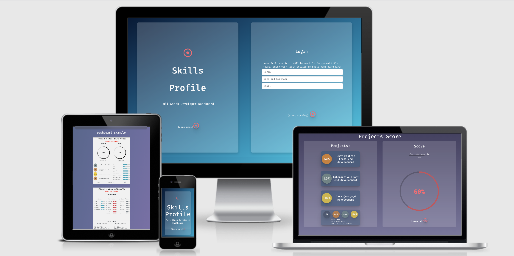
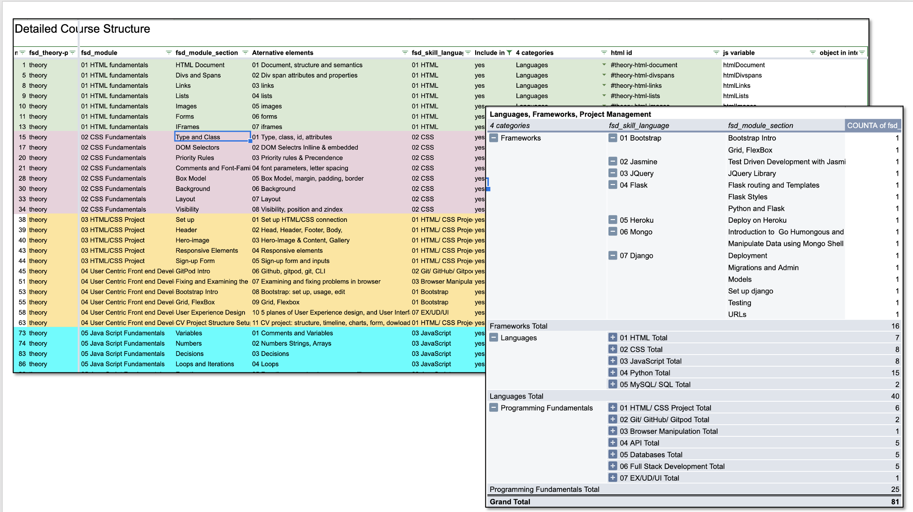
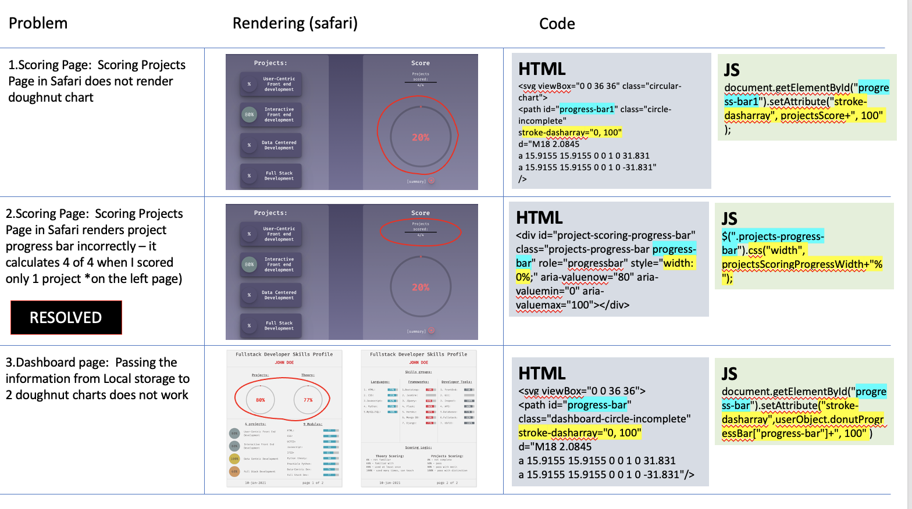
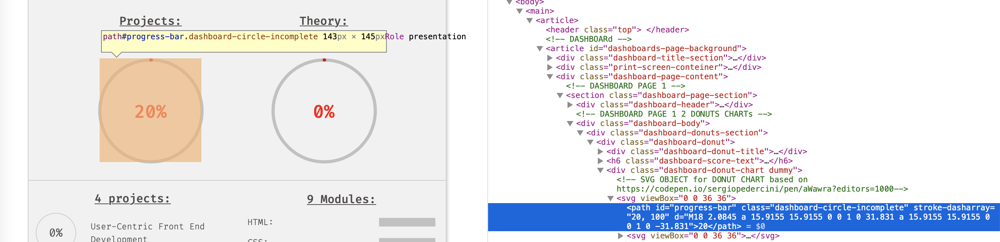
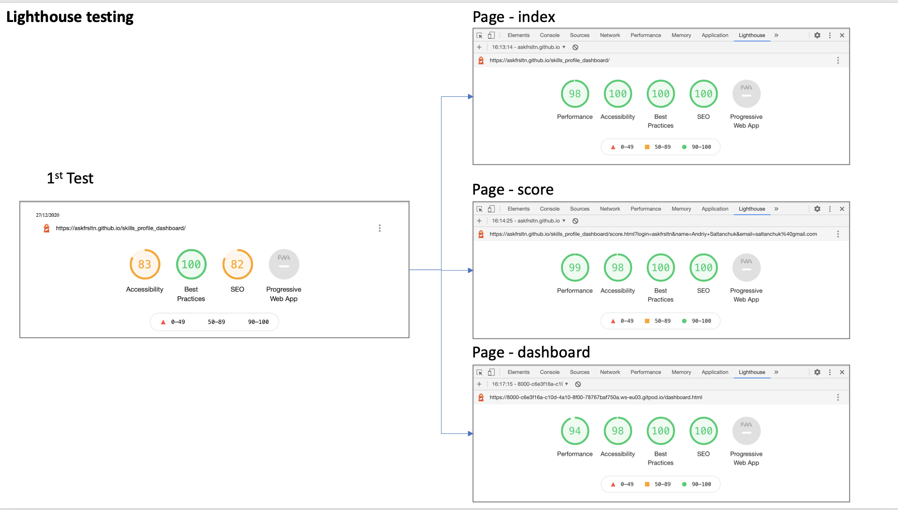
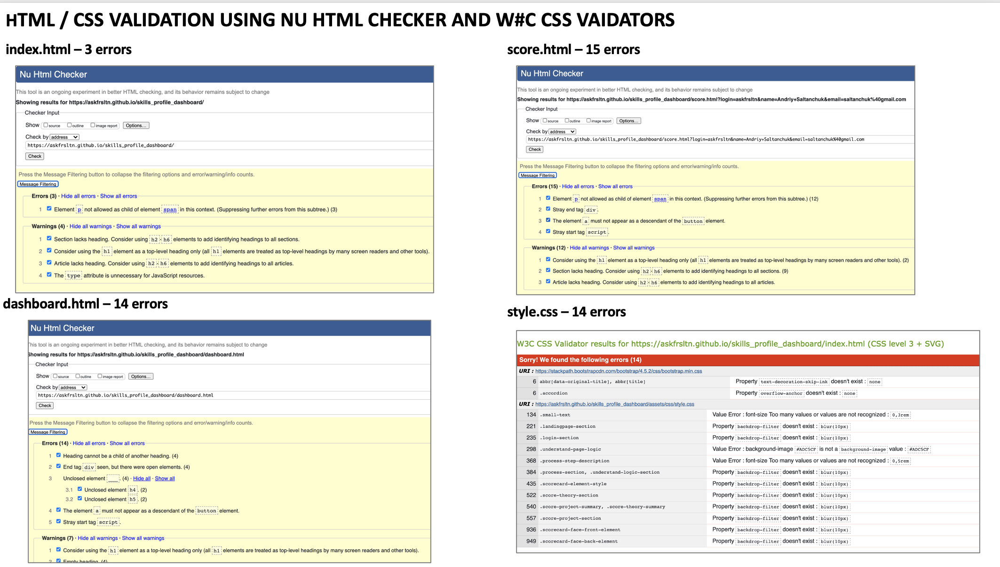

# [FULL STACK DEVELOPER SKILLS PROFILE DASHBOARD]( https://askfrsltn.github.io/skills_profile_dashboard/)

## SUMMARY
This interactive application is developed based on Code Institute Full Sack Developer course as of December 2020. It is an interactive tool to collect scoring click-inputs for 4 projects and 87 theoretical elements to build an individual 2 pages skills profile dashboard consisting of 5 sections - Projects (4 projects), Theory (9 Theory modules), Languages (5 programing languages), Frameworks (7 frameworks and libraries) and Other developers tools.

**Project lnk**: [Full Stack Skills Profile Dashboard](https://askfrsltn.github.io/skills_profile_dashboard/) 
___
**Navigation comments**: 
- Click on the content heading to navigate to the section you want to read.
- Each section heading is a [link](#content) to return to the top of the README page.
___
## CONTENT

[INTRODUCTION](#introduction)

[1. USER DESIGN](#user-design)
        
[1.1 Goals](#goals)

[1.2 User Stories](#user-stories)

[1.2 Structure plain](#structure-plain)

[1.4 Scope Plain](#scope-plain)

[1.5 Sctructure Plain](#structure-plain)

[1.6 Skeleton Plain](#skeleton-plain)

[1.7 Surface Plain](#surface-plain)

[3. FEATURES](#features)

[4. DEVELOPMENT](#development)

[5. TESTING](#testing)

[6. VERSION CONTROL](#version-control)

[7. DEPLOYMENT](#deployment)

[8. CREDITS](#credits)

[9 DISCLAIMERS](#disclaimers)

___

## [INTRODUCTION](#content)

- Full web stack developers and students (further on users). It helps to build a simple, visually appealing, 2 pages personalised developer skills dashboard. The inputs will be provided by a user using an interactive scorecard interface with pre-defined clickable inputs. 
- Skills structure was developed based on CodeInstitute course program (as per Dec 2020). Profile skills are divided into 2 domains - theoretical and practical. 
- Scoring percentage logic is developed based on my practical consulting experience in career development and succession planning.
___

## [USER DESIGN](#content)

### [Goals](#content)
**Developer**
1. Clarify and build a logic of the skill set that Full Stack Development course student will acquire after the course completion.
2. Identify developer skills that still need to be improved, especially from a practical usage point of view.
3. Reinforce knowledge of Javascript, especially in a field of working with dashboards and connecting it to interactive visual design.
4. Learn new functionalities in Interactive Front-end such as canvas object and working with local storage.

**User**
1. Develop a nice looking personal Skills Profile document for a developer resume (send to email or print to a printer).
2. Clarify the full scope of the skills required for Full Stack Developer
3. Identify the areas of expertise that requires more attention to improve from the practical point of view.

### [User Stories](#content)
This web-site is built for Full Stack Development **Students** and  **Developers** pursuing a career in this field
- As a **Potential FSD student** I want to understand what I will learn during the course and set up a baseline using an assessment
- As a **Active FSD Student** I want to understand (a) What’s  is the full scope of skills I am dealing with and (b) which skills still need to be reinforced with practice 
- As a **Junior developer** I want to have a simple electronic dashboard with realistic assessment of my practical and theoretical knowledge use it during a job application process
- As a **Qualified professional**  I want to understand quickly what assignments I can practically cope with as a developer, and which areas still need to be reinforced.

### [Strategy Plain](#content)
**Goals Declaration:** 
1. Help user develop skills profile document with the simple and logical visual representation of acquired practical and theoretical skills acquired during FSD course. 
2. The application may be used during the job application process to answer the questions: "what exactly do you know?" and "what you can practically do?".
3. Major purpose of the application - be able to revisit all the elements learnt during FSD course, assess individual ability to apply the knowledge in practice, at work. It gives confidence to an applicant and understanding where to focus next.

### [Scope Plain](#content)
**Content:** an app needs to have 3 pages - 1) Landing/explanation and login, 2) Scoring Page with a summary section 3) Final output preview - dashboard page to print.
- To structure the content correctly a scope of Full Stack Developer 9 modules was analysed and broken down into smaller elements (see the table in [GoogleSheets file](https://docs.google.com/spreadsheets/d/1SpufglcNxwii_YfiRx_VtilaV6URxorlfLOkcrcpS8o/edit?usp=sharing)). The elements will be used to build a structure of scorecards for Projects and Theory elements (see attachment) assessment. In a simple word - 1 scoring element on the table will be represented by 1 scorecard on a page.
- Standard Scoring Logic will be based on 3 choices both for projects and for theory. For Theory - this logic needs to be based on the level of individual ability to apply certain study element in practice (60% - familiar, 80% - practically applied at least once during the projects,100% -  learnt and used on the projects up to the level when the assessor can teach others). For Projects - each project will have a score based on the awarded mark (60% - pass, 80% - merit or 100%-distinction)
- A final output - dashboard pages should be visual with maximum 2 pages showing a short visual summary of FullStack Developer skills by division on Projects, Theory, show % score for each project and 9 theoretical modules.
- Theoretical elements on the final dashboard will also be grouped by 3 alternative criteria - "Developer Languages", "Frameworks/Libraries" and "Developer tools" with appropriate graphical representation.
**Functionally**: 
- Functionality of the application has 4 goals - 1) Explain to a user the process and the scoring logic; 2) Suggest to a user the accurate scoring choices for Project and Theoretical elements 3) Visualise the scoring progress and scoring result during the scoring, and 4) Build 2 pages of the individually customised dashboard.
    - EXPLANATION: an app should have simple Explanation section about what the application is, what it does, how it works. It should have a dashboard example and scoring choices description for Project and Theory elements
    - INPUTS: an app needs to personalise dashboard therefore there should be a login page with 3 fields  - login, Full Name for dashboard heading and an email. That will help to store the information into local storage
    - INPUTS: an app needs to provide simple 3-choice scoring functionality that can be learnt intuitively and correctly applied during the scoring process. Interactive scorecards should be used for interactive input. 
    - OUTPUT: Visual Representation of Theory and Projects overall score should be updated after each scoring choice. Doughnut chart will be the best choice for visualisation.
    - OUTPUT: Visual Representation of Assessment/Scoring Progress needs to be updated after each scoring choice in a form of a vertical bar for Projects, Overall Theory progress and each module within the theory section
    - OUTPUT: Each Scorecard needs to have interactive user functionality to demonstrate available scoring choices and indicate the status of scoring on each of the scorecards (Yes/No) after the choice has been made so that user can immediately see whether project or theory element is scored or not.

### [Structure Plain](#content)
- The application is focused on functionality, therefore its interactivity has a single purpose of helping a user to build a Full Stack Developer Skills Dashboard without destructive decorations.

 **Features Prioritisation** 
- List of features to prioritise and implementation status:
    - **Logical course structure** - to build calculation logic foundation - priority No1, planning started with it. Implemented
    - **Visual Charts** - priority feature - the key focus of the site - score page and dashboard page. Implemented.
    - **Scorecards** - choice functionality. Implemented.
    - **Local Storage** - priority feature for score page and dashboard page. Implemented.
    - **Description** - Simple description to guide a user. Implemented.
    - **Login** - a feature that helps to store information into local storage and ensure a user has its name on the dashboard. Implemented.
    - **Calculation logic** - absolutely critical priority feature for percentage calculation and visualisation. Implemented.
    - **Description of the scoring logic** - priority feature on the landing/understanding page to guide the user. Implemented
    - **Buttons** - priority feature to navigate between pages and scoring sections. Implemented.
    - **Limited intuitive navigation between pages** - priority feature to avoid confusions. Implemented.
    - **Scoring Progress calculation** - priority feature on the scoring sections, immediately shows to the user how far s/he is from the finish.
    - Personalisation with Name - priority feature - dashboard page works based on login page data inputs. Implemented.
    - **Date stamp** - priority feature on the dashboard page. Implemented.
    - **Option to store data in the local storage** forever and linking it to login data so that it can be retrieved every time the user returns to the website - partially implemented on a storage and dashboard page, though is not built to store user data forever. Implemented.
    - **Modals with warnings** - priority User experience feature to avoid confusing scenario and repetition of data inputs. Implemented.
    - **Standardised scoring choices on each scorecard** to ensure correct calculations of inputs and make user experience ridiculously simple. Implemented.
    - **Decoration with pictures and various fonts** - deprioritised, distracting from core purpose. Not Implemented.
    - **Dark/Light mode for the dashboard** - deprioritised - nice but not practical. Not implemented. 
    - **Print out functionality** - deprioritised due to availability of print screen function across various devices. alternative logic implemented following a recommendation by mentor on the last call.
    - **Connection to google sheets application by API** - deprioritised. Not implemented.
    - **Interactive menu** - built as per wireframe in the earlier version, deprioritised and scrapped halfway through the project.
    - **Ability to use the information after closing the browser** - I wanted to use this functionality and think it would be useful but I stopped developing because I was running late. So I decided that for the user if s/he wants to develop a nice dashboard he may be patient enough to spend 20 minutes on the web for the sake of successful application and do it in one scoring session.

- **Interaction Design** - there are 3 ways that the user will interact with the application: reading the information, field input, mouse clicks
    - **Reading**: First - The landing page will have 2 buttons: "learn more" and "login", learn more button helps the user to open a subpage that describes what s/he needs to do to build a dashboard., Going through the scoring process, the user will constantly read through the comments that help him to make a scoring choice, understand where in the scoring process s/he is and how much more he needs to do to finish the process. 
    - **Field Inputs**: The user needs to enter 1 field input to start the scoring process and go from landing page to the scoring page. The input containing Full Name is critical because it will be used on the dashboard page.
    - **Mouse click**: The user needs to make a predefined choice for each of the project or scoring element. That means that the user will not have a space for error. All the choices then automatically calculated by JavaScript codes. 

- **Information Architecture**  - The app content will be grouped in 3 pages - **Explanation**, **Scoring Input** and **Dashboard** with several subpages. 
        
    1. **Explanation** - the page where the user landed after s/he inputs an URL. It will have 2 subsections, one of them is hidden while another is visible.

    2. **Score page** will be divided into **Summary**, **Project Scoring** and **Theory Scoring** sections, only one of them will be visible to a user:
        - **Scoring Summary** will show projects and theory doughnut charts, scoring progress of each section scoring and 2 buttons directing the user to *Project Scoring* or *Theory scoring* subsection.
        - **Project Scoring** and **Theory Scoring** will be identical, also visible one at a time. Each page will be divided into 2 sections: Visual showing scoring progress and Scoring Result and scorecards themselves. For example, Project Scoring page will have 4 interactive projects scorecards on one side and on the other side it will have Title, Scoring progress e.g. "3 of 4") and a doughnut chart with a circle showing average percentage score calculated based on scorecard choices. Theory scoring page will be more complex because it will have 87 elements grouped into 9 modules. Modules score and progress will be visible and calculated automatically based on elements of scorecard choices. Modules scorecards will be interactive and will respond to click when the clicked the module will slide down uncovering 8-17 elements scorecards for the module. Scorecards will respond to user click in the same manner as projects scorecards. All the scorecards will be double-sided - on one side they will have tile and a chosen score (or % sign if not scored yet), on the reverse side (opened by click) the scorecard will have score choices and brief legend for each score choice (see [Wireframes]("assets/img/wireframes.pdf") in the section below - "Skeleton Plain").

        3. **Dashboard** - preview page of the scoring result a summary of projects and theory scoring grouped into projects, theory modules, Languages, Frameworks and Developer tools (see the detailed table in the [GoogleSheets file](https://docs.google.com/spreadsheets/d/1SpufglcNxwii_YfiRx_VtilaV6URxorlfLOkcrcpS8o/edit?usp=sharing)
        - It is important to mention certain features that will help to avoid confusion when facing some user interaction scenario:
        - The user needs to clearly understand the transition from reading the logic to scoring page and from scoring page to final dashboard preview, therefore. Therefore the app will have modals to warn the user about the transition from login to scoring and from scoring to dashboard page. 
        - There is a scenario when the user wants to go back to scoring after he visits the dashboard page, therefore, for this purpose, there will be a modal with warning that the user will lose dashboard info.
        - The navigation between scoring sections (theory, projects and scoring summary) will not impact the scoring process because it will happen within one page. Every time the choice is  made, the score will be stored in local storage to avoid information loss while navigating between the sections.

### [Skeleton Plain](#content)
**Documents**
Prior to coding I prepared 3 documents in using powerpoint/printed in pdf: (1) Interface Structure an User flow, (2) Detailed user flow, (3) Wireframes for mobile and Desktop:

**Picture 1: User flow**

**Picture 2: Detailed User flow**

**Picture 3: Wireframes (mobile and desktop)**

### Link: [see detailed wireframes document in pdf](https://drive.google.com/file/d/1aWA3Vvm8ca3t3giy7lGN4xQeEzzdPC8s/view?usp=sharing)

**Information Design**
- Information related to individual user will be stored in Local stoarge. Functionally it means that the moment the user enters inputs the name and surename to transition from landing page to scoring page the JS code will generate a new user object and store it in local storage. This object (userObject) will be used to store all the click-inputs everytime when the choice is made on a scoring page. 
- In other words, every scorecard will have a key, and the score choice made by user will be stored in the local storage as a value of that key. The data in user object will be grouped in various objects scores, input for visuals, alculated values (e.g. cumulative average scores), and date. That means that userObject in Local stoarage will be multidimensional.
- userObject will be used again at the moment when the user goes from the scoring page to the dahboard page. The infomation is copied into one dimensional array - dahsboardObject and than values are assigned to identical ids on a page and inserted into html elements to produce graphical dahsboard. the echanism is described in more detailed in the section 3 - Features.
- If the user decides to leave dashboard and start the scoring process again, userObject will be overwritten. Modals will be developped to warn the user about this. 
- That will reinforce the user to make a conscious choice when transitioning from login to scoring page, from scoring page to dashboard and from dashboard back to login page.
- Return from dashboard to scoring page is not built into application to avoid unwanted user navigation.

### [Surface Plain](#content)
- **Layout**
    -  As can be seen on the wireframes (picture 3) to make it maximum functional and responsive to each page is divided into 2 sections. Each section will have either information to read, scorecards to make a choice or a chart showing the result of scoring. Round buttons will be used to navigate from page to page. 

- **Typography**
    - I used only 2 types of fonts:
        - **Fira-Code** - because it is one of the recognised coding fonts, I wanted the application style reminded a coding experience 
        - **Roboto-Mono** - used only on a dashboard page

- **Colors**
    - **FONT** - grey on light pages, cream-white on dark-background
    - **BACKGROUND** - 2 gradient, randomly selected, I used a website to generate gradient colours: https://mycolor.space/gradient 
    - **SPECIAL BACKGROUND CHOICE** - for each pages sub-section I used a frost effect background using backdrop-filter (source: https://webdesign.tutsplus.com/tutorials/how-to-create-a-frosted-glass-effect-in-css--cms-32535--*/), however, it works nicely only in Chrome. Safari and Firefox require canvas, therefore I did not build it in.
    - **BUTTONS** - red dot icons with small text in square brackets were used as a button to navigate between the pages
    - **SCORES** - I used 3 colours for scoring, it follows a medal awards logic - gold, silver, bronze, the same colours were applied for theory elements score colours.
Overall I used colours and fonts to enhance functionality, maintain responsiveness and make priority things (buttons, scores) visible and maintain resemblance to the coding process.

[back to TOC](#content)
___
## [FEATURES](#content)
### 3.1 Interactive Features with JavaScript/JQUERY/JSON
##### P1.LANDING PAGE:
- **Hidden Page Sections**: 2 functions to flip between the landing page and understand page using JQuery library
    
        $(function(){
        $("#menu-button").click(function(){
            $("#js-home-title").slideUp(500); 
            $("#js-card-menu").slideDown(1000);
        }); 
        $("#js-back-login").click(function(){
            $("#js-card-menu").slideUp(500);
            $("#js-home-title").slideDown(1000); 
        }); 
        // the function to return from the bottom of the understand page to landing page
        $("#js-back-login1").click(function(){ 
            $("#js-card-menu").slideUp(500);
            $("#js-home-title").slideDown(1000);});
        });
    

- **ScoreCards interactivity** - unfolding cards with rotating or swipe down/up functionality - showing a) hidden elements within each module and b) flipping face and backside of the scorecard:
        
        $(".scorecard-animation").click(function(){
            $(this).toggleClass("is-open");
        });

- **Scoring Status** for each element once the choice is made the choice graphics are copied from the backside to frontside using JQUERY Traversing functionality:

        $(".score-circle").click(function(){
            let scoreChoice= $(this).text();
            let color=$(this).css("background-color");
            let score = $(this).parent().parent().siblings().find(".scorcard-score");
            $(score).text(scoreChoice); 
            $(score).css("background-color",color)
            
        });
- **Create Local Storage object** - generate login object upon a click of the login button, login button can not be pressed if one of the fields is input incorrectly. The functionality is built with JS JSON and object generation script:

        $("#btn-login").click(function(){
            let login=$("#login").val();
            let loginName=$("#name").val();
            let loginEmail=$("#email").val();          
            let loginObject = {
                "login": login,
                "name": loginName,
                "email": loginEmail
            }
                localStorage.setItem('loginObject', JSON.stringify(loginObject));
        });

- **Slide The scorecard up and Down**  on click:

        $(document).ready(function(){
            $(".scorecard-face-front-element").click(function(){
                $(this).slideUp();
                $(this).siblings().slideDown();
            });
            $(".scorecard-face-back-element").click(function(){
                $(this).slideUp();
                $(this).siblings().slideDown();
            });             
        });

##### P2: SCORING PAGE:
- **Local Storage** - create local storage upon page load:

        let userObject={}
        - **Local Storage** - Create userObject object upon login to add to individual object: scores, progress, progress-bars:

        $(document).ready(function(){
            let userObject={}
            // 1. Create object for scores
            let ids = document.querySelectorAll('.scorcard-score')
            let scoresObject = {}
            for (let i = 0; i < ids.length; i++) {
            scoresObject[ids[i].id] = 0;
            }
            
            // 2. Create object for progress bar
            let progressBar = document.querySelectorAll('.progress-bar')
            let progressBarObject = {}
            for (let i = 0; i < progressBar.length; i++) {
            progressBarObject[progressBar[i].id] = 0;
            }
            
            // 3. Create object for progress            
            let progressNumber = document.querySelectorAll('.progress-number')
            let progressObject = {}
            for (let i = 0; i < progressNumber.length; i++) {
            progressObject[progressNumber[i].id] = 0;
            }
            
            //4. create object for Donut chart numbers test: console.log(progressObject);
            let donutProgressNumbers = document.querySelectorAll('.score-identifier');
            let donutProgressNumbersObject={}
            for (let i = 0; i < donutProgressNumbers.length; i++) {
            donutProgressNumbersObject[donutProgressNumbers[i].id] = 0;
            }

            //5. create object for Donut chart progress bar
            let donutProgressBar = document.querySelectorAll('.circle-incomplete');
            let donutProgressBarObject={}
            for (let i = 0; i < donutProgressBar.length; i++) {
            donutProgressBarObject[donutProgressBar[i].id] = 0;
            }
        
            // 6. add objects to the userObject in localStorage
            userObject.scores=scoresObject; // add scores dataset to object            
            userObject.progressBar=progressBarObject; // add progressBar dataset to object            
            userObject.progress=progressObject; // add progress dataset to object       
            userObject.donutProgressNumbers=donutProgressNumbersObject; //add progress numbers for donut charts into local storage data object
            userObject.donutProgressBar=donutProgressBarObject; 
            
            //7. Save onedimensinal objects inside userObject in local storage using JSON
            localStorage.setItem('userObject', JSON.stringify(userObject)); // store updated data in local storage test: console.log(userObject);  });

- **Moving Between Subsections of the scoring page** - hide summary section, open  THEORY projects scoring page:

        $(function(){
            $("#theory-button").click(function(){ //click event
                $("#js-scoresummary").slideUp(500); 
                $("#js-theory").slideDown(1000);
            }); 
            $("#js-summary-button1").click(function(){//click event 
                $("#js-theory").slideUp(500);
                $("#js-scoresummary").slideDown(1000); 
            });             
        });
- **Rotate Projects scorecard around** - the function flips the project scorecard around on click:
        
        $(".scorecard-animation").click(function(){
            $(this).toggleClass("is-open");
        });
- ***Copy the score choice and formatting into face score circle** - 2 functions to get a score from score circle and set it to scorecard face-front with proper colour - TRAVERSING functionality for all the cards. works for the cards on theory sections: 

        $(".score-circle").click(function(){
            let scoreChoice= $(this).text();
            let color=$(this).css("background-color");
            let score = $(this).parent().parent().siblings().find(".scorcard-score");
            $(score).text(scoreChoice); // score
            $(score).css("background-color",color) // color                  
        }); 

        // same for projects section
        $(".projects-score-circle").click(function(){
            let scoreChoice= $(this).text();
            let color=$(this).css("background-color");
            let score = $(this).parent().parent().siblings().find(".scorcard-score");
            $(score).text(scoreChoice); // score
            $(score).css("background-color",color) // color                      
        });
- **Open List of Module elements** - when the user clicks on a theory module, this helps to roll down the list of elements for each module - using JQUERY and this element of JS: 

        $(".scorecard-animation-module").click(function(){
            $(this).siblings().children().slideToggle(200);
            $(this).parents().siblings().children().find(".scorecard-element").slideUp(200);// close previously open list of element for other modules
            
        });

- **Sliding up and down each theory module element scorecard** - using JQUERY and this JS script:

        $(document).ready(function(){
        $(".scorecard-face-front-element").click(function(){
            $(this).slideUp();
            $(this).siblings().slideDown();
        });
        $(".scorecard-face-back-element").click(function(){
            $(this).slideUp();
            $(this).siblings().slideDown();
        });           });      

- **Calculate project scores** - complex code to calculate projects score and scoring progress inputs based on scorecards choices triggered project scorecard click and insert those values into visual charts:
    - **Open a function on click** - open a separate function on click:

            $(".projects-score-circle").click(function (){
            ...        });
    - **Get the number from the card score** - within the function above, still trigerred by a click

            // 1. turn the string into number from the card score or 0
            let ucfed = parseInt($("#projects-ucfed").text()) || 0; 
            let ifed = parseInt($("#projects-ifed").text()) || 0;
            let dcd = parseInt($("#projects-dcd").text()) || 0;
            let fsd = parseInt($("#projects-fsd").text()) || 0;

    - **Calculate average project score** - within the function above, still trigerred by a click:
            
            let projectsScore= (ucfed+ifed+dcd+fsd)/projectsNumber;
    
    - **Insert calculation into visuals for donut charts** - within the function above, still trigerred by a click:

            $("#projects-overall").text(projectsScore); // set the number to chart % on a projects section
            $("#projects-overall-summary").text(projectsScore);   // set the number to chart % on a summary section

    - **Target Chart visuals** - insert calculation into doughnut chart progress bar
            
            document.getElementById("progress-bar").setAttribute("stroke-dasharray", projectsScore+", 100" ); // set the score to the donut progress RED CIRCLE BAR on the chart section(SVG OBJECT). (JQuery attr() doesn't work)
            document.getElementById("progress-bar1").setAttribute("stroke-dasharray", projectsScore+", 100" );// set the score to the donut progress RED CIRCLE BAR on the SUMMARY page chart (svg object) (JQuery attr() doesn't work)

    - **Setting up a progress vertical bar for projects** - on summary section and on projects scoring section:

            // SCORE. PROJECTS. PROGRESS. progress bar for projects calculation - can be replaced by interesteing array formula ==> map(/\d+/g etc)...
            if(document.getElementById("projects-ucfed").innerText=="%"){
                ucfedProgress = 0; // 
            } else {ucfedProgress = 1;};
            if(document.getElementById("projects-ifed").innerText=="%"){
                ifedProgress = 0;
            } else {ifedProgress = 1;};
            if(document.getElementById("projects-dcd").innerText=="%"){
                dcdProgress = 0;
            } else {dcdProgress = 1;};
            if(document.getElementById("projects-fsd").innerText=="%"){
                fsdProgress = 0;
            } else {fsdProgress = 1;};
            let projectsScoringProgress=ucfedProgress+ifedProgress+dcdProgress+fsdProgress;
                
            // PROGRESS. progress NUMBER for projects on 2 projects summary pages
                $("#project-scoring-progress").text(projectsScoringProgress);
                $("#project-scoring-progress1").text(projectsScoringProgress);
                let projectsScoringProgressWidth = projectsScoringProgress/projectsNumber*100;
            // PROGRESS. vertical progress BAR for projects on 2 summary section and page
                $(".projects-progress-bar").css("width", projectsScoringProgressWidth+"%");

- **Store the scoring result into local storage** 

            // store calculated scores into userObject
            userObject.donutProgressNumbers["projects-overall"]=projectsScore;
            userObject.donutProgressNumbers["projects-overall-summary"]=projectsScore;
            userObject.donutProgressBar["progress-bar"]=projectsScore;
            userObject.donutProgressBar["progress-bar1"]=projectsScore;
            
            // store projects scoring progress for vertical bar
            userObject.progressBar["project-scoring-progress-bar"]=projectsScoringProgressWidth;
            userObject.progressBar["project-scoring-progress-bar1"]=projectsScoringProgressWidth;
            userObject.progress["project-scoring-progress"]=projectsScoringProgress;
            userObject.progress["project-scoring-progress1"]=projectsScoringProgress;

            // store updated userObject into localStorage
            localStorage.setItem("userObject", JSON.stringify(userObject));

- **Theory modules calculation** - a bulky JS code that is triggered by a click on a scoring circle of the element scorecard. It consists of 13 steps: (1) find a module key id, (2) get the scores of the elements from all current module elements, (3) turn the string into numbers array, (4) Calculate average in the array, (5) calculate the sum of scores in the array, (6) Assign average to module score circle on the module scorecard, (7) CHANGE MODULE PROGRESS BAR using traversing, (8) replace key-value pairs with a chosen score from scorecard inside userObject in Local Storage, (9) calculate theory averages based on module averages, (10) Assign numbers to theory Donut Charts visual elements, (11) Calculate inputs for progress bar calculation - substeps a,b,c,d, (12) Assign calculated value to progress bar visuals
Overall the code looks like this:

        $(".score-circle").click(function(){
            //1. find a module key id
            let moduleObjectKey = $(this).parent().parent().parent().parent().parent().siblings().children().find('.scorcard-score').attr("id");
            let moduleKey="#"+moduleObjectKey;
            
            // 2. get the scores of the elements from all the module elements           
            let values = $(this).parent().parent().parent().parent().parent().parent().find('.elements-section').find('.scorcard-score').text();// return all the values within the module
            let value= $(this).text().trim().slice(0,-1);// get rid of spaces and % sign at the end

            //3. turn the string into numbers array - unbelieavable code from https://stackoverflow.com/questions/18712347/how-to-get-numeric-value-from-string - who can ever come up with this logic??? It actually  wokrs!      
            let valuesArray = values.match(/\d+/g).map(Number); 
            
            //4. Calculate average in the array
            let moduleSum = 0 // create elements cum number variable
            let scoredElements = valuesArray.length; // create variable to calculate number of elements scored
            let totalNumberOfElements=$(this).parent().parent().parent().parent().parent().parent().find('.elements-section').find('.scorcard-score').length; // calculates total number of elements;
            
            // 5. calculate sum of scores in the array
            for (let i = 0; i < valuesArray.length; i++) {
                moduleSum += parseInt(valuesArray[i]); 
            }

            //6. Assign average to module score circle on the module scorecard
            let moduleAverageScore = parseInt(moduleSum/totalNumberOfElements); // calculate average module score
            $(moduleKey).text(moduleAverageScore+"%"); // assign calculated average to module scorecard score
            
            // 7. CHANGE PROGRESS BAR
            // a.find this module key
                let thisModuleProgressId= $(this).parent().parent().parent().parent().parent().siblings().find(".module-progress-number").attr("id"); 

            // b. assign the length var to the key - progress number
                $("#"+thisModuleProgressId).text(scoredElements);
            
            // c. calculate percentage for progress bar
                const numberOfElements=$(this).parent().parent().parent().parent().parent().parent().find('.elements-section').find('.scorcard-score').length;
                let moduleProgressBarWidth = parseInt(scoredElements / numberOfElements * 100) ;
            
            // d. assign % to the progress bar 
                $(this).parent().parent().parent().parent().parent().parent().find(".module-progress-bar").css("width", moduleProgressBarWidth+"%");
            
            //8. LOCAL STORAGE. replace key-value pairs with chosen score from scorecard
                
                let key=$(this).parent().parent().siblings().find(".scorcard-score").attr("id");// find card id
                
                userObject=JSON.parse(localStorage.getItem("userObject"));// retrieve object from local storage

                userObject.scores[key]=value;//change value of scored id
                userObject.scores[moduleObjectKey]=moduleAverageScore;//change value of scored id
                userObject.scores[thisModuleProgressId]=scoredElements;//change value of scored id
                
                localStorage.setItem("userObject", JSON.stringify(userObject));//????return object into LocalStorage with updated value  ???? - split to separate functions GROUP BY EVENTS.
                
            //9. CALCULATE THEORY AVERAGES
                userObject = JSON.parse(localStorage.getItem("userObject"));//retrieve object from LocalStorage
                
                const numberOfModules=$.find('.scorecard-module').length;// count number of theory modules
                let theoryHtml = userObject.scores["theory-html"]; // assign html module score to var
                let theoryCss = userObject.scores["theory-css"]; //assign css module score to var
                let theoryUcfed = userObject.scores["theory-ucfed"]; //assign ucfed module score to var
                let theoryJs = userObject.scores["theory-js"] //assign js module score to var
                let theoryIfed = userObject.scores["theory-ifed"] // assign ifed module score to var
                let theoryPythonfu = userObject.scores["theory-pythonfu"] //assign python theory module score to var
                let theoryPythonpr = userObject.scores["theory-pythonpr"]//assign python module score to var
                let theoryDcd = userObject.scores["theory-dcd"]//assign dcd module score to var
                let theoryFsd = userObject.scores["theory-fsd"]//assign fsd module score to var
                
                let theoryScoreFloat = (theoryHtml+theoryCss+theoryUcfed+theoryJs+theoryIfed+theoryPythonfu+theoryPythonpr+theoryDcd+theoryFsd)/numberOfModules; //calculate theory score for charts
                let theoryScore=Math.round(theoryScoreFloat); //had to make a separate variable to round it, strange.
                
            //10. Assign numbers to 2 theory Donut Charts including red progress bar
                $('#theory-overall').text(theoryScore);// asign number to donut chart on theory scorring section
                $('#theory-overall-summary').text(theoryScore);// asign number to donut chart on theory scorring section

                document.getElementById("progress-bar-theory1").setAttribute("stroke-dasharray", theoryScore+", 100" ); // // asign number to donut chart progress bar on theory scorring section (for some reason JQ attr() doesnot work)
                document.getElementById("progress-bar-theory").setAttribute("stroke-dasharray", theoryScore+", 100" ); // asign number to donut chart progress bar on theory scorring section (for some reason JQ attr() doesnot work)

            //11. Calculate inputs for progress bar calculation
                // a. count all the elements scorecards without modules
                const numberOfTheoryElements = $.find(".scorecard-element").length; 
                // b. return all the scored elements values within the module
                let allTheScoredElements = $('.scorecard-element').find('.scorcard-score').text();
                //c. Make an array from found values and count number of scores for all the elements. Use crazy code from https://stackoverflow.com/questions/18712347/how-to-get-numeric-value-from-string again.   
                let numberOfScoredElements = allTheScoredElements.match(/\d+/g).map(Number).length; // count number of elements that have been scored
                // d. calculate width of the theory scoring bar
                let theoryProgressBarWidth = numberOfScoredElements/numberOfTheoryElements*100; 
            
            //12. Assign calculated value to progress bar visual
                $('#theory-scoring-progress1').text(numberOfScoredElements); // 
                $('#theory-scoring-progress').text(numberOfScoredElements);
                $(".theory-progress-bar").css("width", theoryProgressBarWidth+"%");
- **Store the values inside userObject into Local storage** - this JS code is executed within score circle click code, first the values are stored in the user object, then saved in local storage:

        //THEORY. LOCAL STORAGE. Store donut the inputs into local storage 
                // a. visual elements assigned to unique ids in userObject

                    userObject.progress["theory-scoring-progress"]=numberOfScoredElements;
                    userObject.progress["theory-scoring-progress1"]=numberOfScoredElements;

                    userObject.progressBar["theory-scoring-progress-bar"]=theoryProgressBarWidth;
                    userObject.progressBar["theory-scoring-progress-bar1"]=theoryProgressBarWidth;
                    
                    userObject.donutProgressNumbers["theory-overall"]=theoryScore;
                    userObject.donutProgressNumbers["theory-overall-summary"]=theoryScore;

                    userObject.donutProgressBar["progress-bar-theory"]=theoryScore; // check accuracy
                    userObject.donutProgressBar["progress-bar-theory1"]=theoryScore; // check accuracy
                    
                    // b. userObject saved in localStorage
                    localStorage.setItem("userObject", JSON.stringify(userObject));    
##### P3: DASHBOARD PAGE:
- **Create new variables for new skills groups visuals on the skills profile** 

        // 1. DEFINE NEW SET OF VARIABLES -"SKILLS"- THAT EXIST ONLY ON THIS PAGE - SEE PAGE 2 OF THE DASHBOARD
            //a. find all skill IDs and place it in userObject in local Storage
            let skills = document.querySelectorAll('.skill-identifier');//specific ids
            let skillsObject = {} // push found ids to sperate object
            for (let i = 0; i < skills.length; i++) {
            skillsObject[skills[i].id] = 0;
            }    

            //b.   get date stamp and place it into the dashboard
            let dates = document.querySelectorAll('.date');//specific ids       let datesObject = {}
            // ids update and Adutomatic date stamp for dashboard pages with the help of  https://www.w3schools.com/js/tryit.asp?filename=tryjs_date_month
            for (let i = 0; i < dates.length; i++) {
                let date=new Date
                let months=["jan","feb","mar","apr","may","jun","jul","aug","sep","oct","nov","dec"]
                let d=date.getDate()+"-"+months[date.getMonth()]+"-"+date.getFullYear();
                datesObject[dates[i].id] = d;

- ***Get Data form local storage userObject** - this step is needed to work with visuals on the dashboard page:    
        
        // retrieve userObject from the localStoarge
        userObject=JSON.parse(localStorage.getItem("userObject")); // parse from LocalStorage       

- **Create a new group of visuals for 2nd page** - this step unfortunately required quite simple but long routine manual coding and calculation in JS. To prepare for this step I grouped the skills and theory elements in a separate table in Google sheet (see picture 4 for fragment image). If interested you can see complete file following the link -  [complete GoogleSheets file](https://docs.google.com/spreadsheets/d/1SpufglcNxwii_YfiRx_VtilaV6URxorlfLOkcrcpS8o/edit?usp=sharing). 

    **Picture 4: Fragment of skills analysis table:**
    

    Java Script code:

        // 3.CALCULATE SKILLS VARIABLES FOR DASHBOARD PAGE to assign it later to all the html elements

        // LANGUAGES
            // HTML
            skillsObject["dashboard-skill-html"]=parseInt((parseInt(userObject.scores["theory-html-document"])+parseInt(userObject.scores["theory-html-divspans"])+parseInt(userObject.scores["theory-html-links"])+parseInt(userObject.scores["theory-html-lists"])+parseInt(userObject.scores["theory-html-images"])+parseInt(userObject.scores["theory-html-forms"])+parseInt(userObject.scores["theory-html-iframes"]))/7)+"%"; 

            // CSS
            skillsObject["dashboard-skill-css"]=parseInt((parseInt(userObject.scores["theory-css-background"])+parseInt(userObject.scores["theory-css-boxmodel"])+parseInt(userObject.scores["theory-css-fonts"])+parseInt(userObject.scores["theory-css-domselectors"])+parseInt(userObject.scores["theory-css-layout"])+parseInt(userObject.scores["theory-css-priority"])+parseInt(userObject.scores["theory-css-typeclass"])+parseInt(userObject.scores["theory-css-visibility"]))/8)+"%"; 
            
            //JAVASCRIPT
            skillsObject["dashboard-skill-js"]=parseInt((parseInt(userObject.scores["theory-js-variables"])+parseInt(userObject.scores["theory-js-numbers"])+parseInt(userObject.scores["theory-js-decisions"])+parseInt(userObject.scores["theory-js-loops"])+parseInt(userObject.scores["theory-js-dom"])+parseInt(userObject.scores["theory-js-functions"])+parseInt(userObject.scores["theory-js-oop"])+parseInt(userObject.scores["theory-js-console"]))/8)+"%"; 

            // PYTHON
            skillsObject["dashboard-skill-python"]=parseInt((parseInt(userObject.scores["theory-python-numvartypes"])+parseInt(userObject.scores["theory-python-strings"])+parseInt(userObject.scores["theory-python-userinputs"])+parseInt(userObject.scores["theory-python-boolean"])+parseInt(userObject.scores["theory-python-indexing"])+parseInt(userObject.scores["theory-python-reuse"])+parseInt(userObject.scores["theory-python-scopingfunctions"])+parseInt(userObject.scores["theory-python-mdules"])+parseInt(userObject.scores["theory-python-mutability"])+parseInt(userObject.scores["theory-python-dictionaries"])+parseInt(userObject.scores["theory-python-projectsetup"])+parseInt(userObject.scores["theory-python-projectexpand"])+parseInt(userObject.scores["theory-python-upgrade"])+parseInt(userObject.scores["theory-python-datamanipulation"])+parseInt(userObject.scores["theory-python-interface"]))/15)+"%";

            //MYSQL
            skillsObject["dashboard-skill-sql"]=parseInt((parseInt(userObject.scores["theory-mysql-dtbmntstm"])+parseInt(userObject.scores["theory-mysql-python"]))/2)+"%";

            // FRAMEWORKS calculation
                // Bootstrap,Grid
                skillsObject["dashboard-skill-bootstrap"]=parseInt((parseInt(userObject.scores["theory-ucfed-bootstrap"])+parseInt(userObject.scores["theory-ucfed-gridflexbox"]))/2)+"%";
  
                //JASMINE
                skillsObject["dashboard-skill-jasmine"]=parseInt(userObject.scores["theory-ifed-jasmine"])+"%";
                
                //JQUERY
                skillsObject["dashboard-skill-jquery"]=parseInt(userObject.scores["theory-ifed-jquery"])+"%";

                // FLASK
                skillsObject["dashboard-skill-flask"]=parseInt((parseInt(userObject.scores["theory-python-flask"])+parseInt(userObject.scores["theory-python-flaskstyles"])+parseInt(userObject.scores["theory-python-flasktemplates"]))/3)+"%";
                
                //MONGO
                skillsObject["dashboard-skill-mongo"]=parseInt((parseInt(userObject.scores["theory-mongodb-intro"])+parseInt(userObject.scores["theory-mongodb-shell"]))/2)+"%";

                //DAJNGO
                skillsObject["dashboard-skill-django"]=parseInt((parseInt(userObject.scores["theory-django-isetup"])+parseInt(userObject.scores["theory-django-urls"])+parseInt(userObject.scores["theory-django-adminmigration"])+parseInt(userObject.scores["theory-django-models"])+parseInt(userObject.scores["theory-django-deploy"])+parseInt(userObject.scores["theory-django-test"]))/6)+"%";

                //HEROKU
                skillsObject["dashboard-skill-heroku"]=parseInt(userObject.scores["theory-python-heroku"])+"%"; 

            // DEVELOPER TOOLS
                // FRONT END
                skillsObject["dashboard-skill-project"]=parseInt((parseInt(userObject.scores["theory-ucfed-setup"])+parseInt(userObject.scores["theory-ucfed-header"])+parseInt(userObject.scores["theory-ucfed-signupform"])+parseInt(userObject.scores["theory-ucfed-heroimage"])+parseInt(userObject.scores["theory-ucfed-responsiveness"])+parseInt(userObject.scores["theory-ucfed-cvsetup"]))/6)+"%";

                // GIT
                skillsObject["dashboard-skill-git"]=parseInt((parseInt(userObject.scores["theory-ucfed-git"])+parseInt(userObject.scores["theory-python-gitpod"]))/2)+"%";
                
                //INSPECT
                skillsObject["dashboard-skill-browser"]=parseInt(userObject.scores["theory-ucfed-inspect"])+"%";
                
                //API
                skillsObject["dashboard-skill-api"]=parseInt((parseInt(userObject.scores["theory-ifed-datadom"])+parseInt(userObject.scores["theory-ifed-api"])+parseInt(userObject.scores["theory-ifed-apiemail"])+parseInt(userObject.scores["theory-ifed-apigithub"])+parseInt(userObject.scores["theory-ifed-apimaps"]))/5)+"%"; 
                
                //DATABASES
                skillsObject["dashboard-skill-databases"]=parseInt((parseInt(userObject.scores["theory-databases-basics"])+parseInt(userObject.scores["theory-databases-reldesign"])+parseInt(userObject.scores["theory-dcd-addtask"])+parseInt(userObject.scores["theory-dcd-setup"])+parseInt(userObject.scores["theory-dcd-navigation"]))/5)+"%";
                
                //FULL STACK
                skillsObject["dashboard-skill-fsdframeworks"]=parseInt((parseInt(userObject.scores["theory-fsd-setupproject"])+parseInt(userObject.scores["theory-fsd-authenticate"])+parseInt(userObject.scores["theory-fsd-basetemplate"])+parseInt(userObject.scores["theory-fsd-homepage"])+parseInt(userObject.scores["theory-fsd-productssetup"])+parseInt(userObject.scores["theory-fsd-checkout"])+parseInt(userObject.scores["theory-fsd-coderefactor"])+parseInt(userObject.scores["theory-fsd-profileapp"])+parseInt(userObject.scores["theory-fsd-deploy"])+parseInt(userObject.scores["theory-fsd-emails"]))/10)+"%";
                
                //USER DESIGN
                skillsObject["dashboard-skill-udui"]=parseInt(userObject.scores["theory-ucfed-uxd"])+"%";

        userObject.skills=skillsObject; // add skills object into userObject
        userObject.dates=datesObject; // add dates object into userObject

- **Collect ids from the page** - new array was created using map function.

        // 4. GENERATE AN ARRAY WITH ALL THE IDS ON A PAGE    
        //create an array with all the ids on a page
        let dashboardIds = []; 
            dashboardIds = $("*").map(function() { 
                if (this.id) { 
                    return this.id; 
                } 
            }).get();

- **Turn multidimensional userObject into onedimensional array** - simple a step code.

        //a. retrieve 6 objects from user object
        userObjectDonutProgressBar=userObject.donutProgressBar;
        userObjectDonutProgressNumbers=userObject.donutProgressNumbers;
        userObjectProgress=userObject.progress;
        userObjectProgressBar=userObject.progressBar;
        userObjectScores=userObject.scores;
        userObjectSkills=userObject.skills;
        userObjectDates=userObject.dates
        
        // b. combine 7 objects inside dashboard Object, add name them appropriately 
        let dashboardObject={...userObjectDonutProgressBar,...userObjectDonutProgressNumbers,...userObjectProgress,...userObjectProgressBar,...userObjectScores,...userObjectSkills,...userObjectDates};
        
        // c. add user name to onedimensional array
        loginObject=JSON.parse(localStorage.getItem("loginObject"));
        dashboardObject.name=loginObject.name;// add name variable from login into Dashboard object
        dashboardObject.email=loginObject.email; // add email variable from login into Dashboard object

- **Assign values from userObject to dashboard object** - this step is required to assign all the existing values to ids on a page duplicating scores and visual elements from local storage to the dashboard. This code was generated with the support of CodeInstitute tutor - Tim.
        
        // !! loop over Object key/value: https://developer.mozilla.org/en-US/docs/Web/JavaScript/Reference/Global_Objects/Object/entries 
        for (const [key, value] of Object.entries(dashboardObject)) {
            if (`${value}`!==0){ //check if the value is 0
            $(`#${key}`).text(`${value}`);
            }else{}
        }

- **Assign values from the object to visuals** - manual code, initially it was planned to use loops but due to different nature of visuals, it was decided to use the manual method.

        //7. ASSIGN VISUALS ATTRIBUTES ON A DASHBOARD PAGES
        // a. DONUT CHART BARS. visuals for Donut charts
            document.getElementById("progress-bar").setAttribute("stroke-dasharray", userObject.donutProgressBar["progress-bar"]+", 100" );//set up a progress bar on the project donut chart
            document.getElementById("progress-bar-theory").setAttribute("stroke-dasharray", userObject.donutProgressBar["progress-bar-theory"]+", 100" );//set up a progress bar on the project donut chart
        
        // b. ROJECTS MEDALS. find project medals check the value, add class. I simply hard coded the style condition, it took me 20 min, before that I spent 3 hours tring to find the way to make 1) an array of ids and values, 2) create a switch condition inside the loop to addclass depending on 60,80 or 100. BUT It works.
            
            let ucfed=$("#projects-ucfed").text();
            let ifed=$("#projects-ifed").text();
            let dcd=$("#projects-dcd").text();
            let fsd=$("#projects-fsd").text();

            if(ucfed==60){
            $("#projects-ucfed").parent().parent().addClass("bronze");
            } else if (ucfed==80){$("#projects-ucfed").parent().parent().addClass("silver");} else if (ucfed==100){$("#projects-ucfed").parent().parent().addClass("gold");}else{}
            
            if(ifed==60){
                $("#projects-ifed").parent().parent().addClass("bronze");
            } else if (ifed==80){$("#projects-ifed").parent().parent().addClass("silver");} else if (ifed==100){$("#projects-ifed").parent().parent().addClass("gold");}else{}

            if(dcd==60){
                $("#projects-dcd").parent().parent().addClass("bronze");
            } else if (dcd==80){$("#projects-dcd").parent().parent().addClass("silver");} else if (dcd==100){$("#projects-dcd").parent().parent().addClass("gold");}else{}

            if(fsd==60){
                $("#projects-fsd").parent().parent().addClass("bronze");
            } else if (fsd==80){$("#projects-fsd").parent().parent().addClass("silver");} else if (fsd==100){$("#projects-fsd").parent().parent().addClass("gold");}else{}
        
        // c. MODULE BARS. 
            $("#theory-html").css("width",userObject.scores["theory-html"]+"%");
            $("#theory-css").css("width",userObject.scores["theory-css"]+"%");
            $("#theory-ucfed").css("width",userObject.scores["theory-ucfed"]+"%");
            $("#theory-js").css("width",userObject.scores["theory-js"]+"%");
            $("#theory-ifed").css("width",userObject.scores["theory-ifed"]+"%");
            $("#theory-pythonfu").css("width",userObject.scores["theory-pythonfu"]+"%");
            $("#theory-pythonpr").css("width",userObject.scores["theory-pythonpr"]+"%");
            $("#theory-dcd").css("width",userObject.scores["theory-dcd"]+"%");
            $("#theory-fsd").css("width",userObject.scores["theory-fsd"]+"%");
        
        // d. MODULE BARS. 
            $("#theory-html").css("width",dashboardObject["theory-html"]+"%");
            $("#theory-css").css("width",dashboardObject["theory-css"]+"%");
            $("#theory-ucfed").css("width",dashboardObject["theory-ucfed"]+"%");
            $("#theory-js").css("width",dashboardObject["theory-js"]+"%");
            $("#theory-ifed").css("width",dashboardObject["theory-ifed"]+"%");
            $("#theory-pythonfu").css("width",dashboardObject["theory-pythonfu"]+"%");
            $("#theory-pythonpr").css("width",dashboardObject["theory-pythonpr"]+"%");
            $("#theory-dcd").css("width",dashboardObject["theory-dcd"]+"%");
            $("#theory-fsd").css("width",dashboardObject["theory-fsd"]+"%");
        
        // e. SKILLS BARS. 
            //languages
            $("#dashboard-skill-html").css("width",dashboardObject["dashboard-skill-html"]);
            $("#dashboard-skill-css").css("width",dashboardObject["dashboard-skill-css"]);
            $("#dashboard-skill-js").css("width",dashboardObject["dashboard-skill-js"]);
            $("#dashboard-skill-python").css("width",dashboardObject["dashboard-skill-python"]);
            $("#dashboard-skill-sql").css("width",dashboardObject["dashboard-skill-sql"]);
        
            //frameworks
            $("#dashboard-skill-bootstrap").css("width",dashboardObject["dashboard-skill-bootstrap"]);
            $("#dashboard-skill-jasmine").css("width",dashboardObject["dashboard-skill-jasmine"]);
            $("#dashboard-skill-jquery").css("width",dashboardObject["dashboard-skill-jquery"]);
            $("#dashboard-skill-flask").css("width",dashboardObject["dashboard-skill-flask"]);
            $("#dashboard-skill-heroku").css("width",dashboardObject["dashboard-skill-heroku"]);
            $("#dashboard-skill-mongo").css("width",dashboardObject["dashboard-skill-mongo"]);
            $("#dashboard-skill-django").css("width",dashboardObject["dashboard-skill-django"]);

            // developer tools
            $("#dashboard-skill-project").css("width",dashboardObject["dashboard-skill-project"]);
            $("#dashboard-skill-git").css("width",dashboardObject["dashboard-skill-git"]);
            $("#dashboard-skill-browser").css("width",dashboardObject["dashboard-skill-browser"]);
            $("#dashboard-skill-api").css("width",dashboardObject["dashboard-skill-api"]);
            $("#dashboard-skill-databases").css("width",dashboardObject["dashboard-skill-databases"]);
            $("#dashboard-skill-fsdframeworks").css("width",dashboardObject["dashboard-skill-fsdframeworks"]);
            $("#dashboard-skill-udui").css("width",dashboardObject["dashboard-skill-udui"]);
-**Assign other ids on a page** - name on a page 2 was assigned using the value from local storage.
        
        //8. ASSIGN OTHER IDS THAT WERE MISSED IN THE STEP NUMBER 6
            $("#name1").text(loginObject.name);//name to second page id

##### MODALS:
- **Modal Interactivity** - warning to a user when s/he decides to leave scoring page navigating to the dashboard and when s/he wants to navigate from dashboard to the login page:

        // a. back to login
        $("#login-button").click(function(){
            $(".modal-container").removeClass("hidden");
        });
        $(".modal-container").click(function(){
            $(".modal-container").addClass("hidden");
        });

        // a. back to login
        $("#dashboard-button").click(function(){
            $(".dashboard-modal-container").removeClass("hidden");
        });
        $(".dashboard-modal-container").click(function(){
            $(".dashboard-modal-container").addClass("hidden");
        });

#### 3.2 Challenges
1. **Javascript** is a big massive challenge for me. It is hard to master, hard to remember for me. Long story to tell for one readme file

2. **Doughnut Charts** - canvas was used to develop an interactive charts with scg objects. example code was found here: https://codepen.io/erinesullivan/pen/dmdBpQ

2. **Summary report customisation** - I decided that the easiest way to solve this was to make the pages irresposnsive with fixed width and hight to alow the user see the output as it will look like when printed, in this way the pages can be easily taken from the screen by using accessible Windows (printScrieen), iOS (Capture) or taking a screen picture on any device. I used an A4 paper ratio (roughly 1:2). It is easy to zoom and printscreen the dashboard once the page is open.

3. **Local Storage** to store the scoring result and copy the result into elements on the dashboard page I used JSON functionalyity of interacting with local storage.

4. **SVG objects positioning** - till now I don't know how to center the number in the middle of Donut chart. I managed to do that but the solution was not logical. I use 47% to position an average % number in the middle of donut chart. 47% percent was a guess. Here is a css code:

        .projects-score{
            position:relative;
            top: 47%;
            height: 5vh;
        }

5. **Firefox compatibility** - Sometimes JS code that adjusts doughnut charts progress bar does not work, I target progress bar with JQ code, but for some reason during testing safari reacts with significant delay or does not adjust the progress bar at all. I also had an issue with flexbox code - justify-content. On a theory scorecard page, all my modules scorecards were jammed to fit the section which made it impossible to operate. it was resolved by adding 2 property line into CSS code (display: WebKit-flex):

        .score-theory-section{
            display: -webkit-flex; /* NEW - Chrome */**
            display: flex;             /* NEW, Spec - Opera 12.1, Firefox 20+ */
            flex-direction: column;
            align-items: center;
            justify-content: flex-start;
            height: 85vh;
            width: 72vh;    
            position: relative;
            overflow: auto;
            border-radius: 10px;
            margin: 10px;
            background-color: rgba(255, 255, 255, .15); 
            backdrop-filter: blur(10px);
            margin-bottom: 10px;
            order: 1;
        }
    
6. **Safari compatibility** - there were 3 issues with Safari 2 of them remain unresolved. The code I built in JS was taking the value from local storage once the user landed on the dashhboard page, and passed it to svg object to change the red doughnut bar according to calculated scoring percentage. The code works for Chrome and Firefox, howver it never works for Safari. The most interesting thing was that the value is passed to "stroke-dasharray" attribute of the element, however it is not rendered. Below you will see the detailed explanation of the problem, the testing I did and suggested solution I used following the advice of Bim - the Alumni over the slack:

- **testing**: I checked the console of the svg visual that was supposed to change and I saw that the code passed the value to "stroke-dasharray"property that is responsible for proper rendering-it has a value of 20, but on the page it shows a value of 0:

I went back to HTML file and changed the same property manually to 50:
    <path id="progress-bar" class="dashboard-circle-incomplete"        stroke-dasharray="50, 100"
    d="M18 2.0845
    a 15.9155 15.9155 0 0 1 0 31.831
    a 15.9155 15.9155 0 0 1 0 -31.831"></path>

It worked well and the doughnut chart rendered the chart the way it was expected. I checked the value from local object received as a result of scoring exeercise and also its type:
    
        console.log(document.getElementById("progress-bar"))
        console.log(typeof(userObject.donutProgressBar["progress-bar"]))
and received:
    
        20
        number

That means that the code worked and the problem was in rendering. 

- **potential soluton**: I contacted Slack community with th erequest. Bim was very kind to spend some time with me and help me develop some solutions, that also did not work. For example he suggested to use a dummy class that does not make any impact and use JS addclass method to trigger object rendering again. so I did:

        /*-- SAFARI SOLUTION CLASS - I use it to make safari read updated stroke-dasharray--*/
        .dummy{
            border:none;
        }

        $(".dashboard-donut-chart").addClass("dummy")// dummy class to update svg objects in Safari

[back to TOC](#content)
___

## [DEVELOPMENT](#content)

### [4.1 Technologies](#content)
- Major focus of development was on developing interactive features with calculation and local storage functionality. I used plain JavaScript and JQuery in most of the cases.
- For local storage interaction I used JSON.
- Most of the HTML and CSS elements on the page were managed with FlexBox - simple and easy.

### [4.2 Sources](#content)

- **Code Institute Schedule Generator** - all the components of the application were taken from this site: https://code-institute-org.github.io/schedule-generator-v2/ - fantastic tool and a source of information.

- **Libraries:** 
    - **JQUERY** - this library is much more intuitive to use. In some cases when I tried to set up attributes JQUERY did not work. JQUERY source - https://jquery.com/ 
    - **FlexBox** - CSS library - very simple and effective way to operate with HTML box elements: https://www.w3schools.com/css/css3_flexbox.asp
    - **Bootstrap** - used for vertical bar visuals and buttons. https://getbootstrap.com/

- **Gradient Colors** - recommendation from Kseniya Denisova - https://mycolor.space/gradient?ori=to+right+bottom&hex=%23152C50&hex2=%236144B5&sub=1

- **Background Frost Effect** -  2 ways to do it. One was relatively simple using backdrop-filter- https://webdesign.tutsplus.com/tutorials/how-to-create-a-frosted-glass-effect-in-css--cms-32535.  However, it doesn't work for Safari and Firefox

- **Dashboard prototype** - https://canvasjs.com/samples/dashboards/annual-sales-website-traffic/

- **Donut charts** - I used the code with svg elements and then customised it. https://codepen.io/erinesullivan/pen/dmdBpQ

- **Canvas JS** - I familiarised myself with canvas, even though I did not use it, still it was good to know about the resource

- **Google Sheets** - my analysis of CodeInstitute course was done in GooogleSheets. It helped me create the structure of the scoring page - you can find details here [GoogleSheets file](https://docs.google.com/spreadsheets/d/1SpufglcNxwii_YfiRx_VtilaV6URxorlfLOkcrcpS8o/edit?usp=sharing)

- **Am I responsive** - for responsiveness Testing and project image on the README.

- **StackOverflow**- - it is an amazing source for every programmer, I found a lot of useful tips and wasted a lot of time on this site.

- **Chris Coyer** - he wrote many articles but [this one](https://css-tricks.com/almanac/properties/b/background-image/) is very useful for the background image, a week before submission I dropped an idea of using a background image for the app. Even though it looked cool, I was not able to master it for Safari and Firefox.

### [4.3 Development Process](#content)
I planned to spend 15 days on it but spent more than 45 days. Difficulties came from a lack of expertise in JavaScript. I also wasted time on some feature that I later eliminated (e.g. interactive menu and dark/light mode). I also wasted time on Donut charts elements, I used various sources however returned to the one I started with.

**Steps**: 
1. 4 Planes of UX to develop Wireframes
2. Set up repository and structure of README
3. Develop and Test challenging and interactive features in the library
    * Cards
    * Charts
    * Progress bars
    * Printout page
    * Individual customisation (dark and Light mode)
4. Develop printout pages in HTML and set up modes functionality 
5. Develop a calculation engine for percentages and arrays structure
6. Develop HTML and CSS page
    * Home page
    * Assessment page
    * Summary Page
    * Customisation (input fields and Emailjs)
7. Organise JavaScript files for the pages
8. Deploy
9. Test all the pages and assessment functionality
10. Peer code review feedback
11. Fix bugs, experiment with various style features. 
12. finalise README
13. Submit for assessment

### [4.4 Features that were not installed](#content)
1. Print option on a dashboard page to convert the page into pdf.
2. dark/light mode on a dashboard pages
3. Pareto charts for all the skills were too much for this project that already grew out of proportion comparing to the requirements.
4. I wanted to make a code that generates HTML using javascript but did not manage to do that, however, I do realise it would save me a lot of code on HTML. I simply did not find the way how to utilise Document.createElement(), Mode.append.Child(), insert before etc. The gap I plan to fill later on.

[back to TOC](#content)
___

## [TESTING](#content)

### [5.1 Lighthouse Testing](#content)
* Thanks to Anna - CodeInstitue tutor and her webinar I learnt about lighthouse tool to test performance, accessibility, best practice, SEO and progressive web application testing. It is a great tool integrated into google chrome web-browser. If you want to use it - go to your webpage, press right-click, then select inspect, in the right-top corner you will find a developer menu, search next to responsiveness and in line with other important feature section "Lighthouse". You will find a button generating the report, before hitting it you will need to select the options you want to see.
* **Picture 5: Lighthouse testing summary, start and finish** 

### [5.2 HTML/CSS Validation](#content)
2nd round of testing, 1st round had 700 errors only on the score page, 2nd round had 46 errors in total, some of the errors were not fixed on purpose. E.g. WebKit error was not fixed, because when fixed the theory scoring page was not responsive anymore and jammed all the scorecards, that is linked to flexbox functionality.
* **Picture 6: HTML validation at https://validator.w3.org/** 

### [5.3 User testing](#content)
I submitted the project to the slack - no response, that means the app is not exciting however nobody provided meaningful feedback. So, I tested it myself.
___

## [VERSION CONTROL](#content)
Cloud-based GitHub and Gitpod applications were used for this project. About 90 commits were done through the course of application development.
___
## [DEPLOYMENT](#content)
I deployed the site through gitpod and Github. I followed the steps:

1. Gitpod: git add .
2. Gitpod: git commit -m "message"
3. Gitpod: git push
4. Github: selected repository: "FSD Skills Profile"
5. Github: grey menu selected tab "Settings"
6. Github: Scrolled down to "Github Pages", from dropdown menu section selected "branch: master"
7. Github: Press Save button. 

* The link to the repository on a GitHub: FULL STACK DEVELOPER SKILLS PROFILE DASHBOARD repository (https://github.com/askfrsltn/skills_profile_dashboard)
* Website link: [Full Stack Skills Profile Dashboard](https://askfrsltn.github.io/skills_profile_dashboard/)

 ___
## [CREDITS](#content)
- **StackOverflow** with thousands of developers from the past and present who shared their knowledge. I simply can not mention all of them.
- **CodeInstitute** - for the course materials and Full Stack Development Course structure provided on course schedule generator. 
- **CodeInstitute Tutors** - especially big thanks to Stephen, Tim, Haley, Cormac, Miklos. Without you, I wouldn't be able to complete this project.
- **CodeInstitute mentor** - special thanks to my mentor Ignatius. For his knowledge, for his patience, for the calm and quiet inspiration. At some point, the call with him helped me recover from the despair and frustration over this project. So, I carry on on my developer journey. 
- **CodeInstitute Community** - big "THANK YOU" to Anna Greaves - a source of knowledge, energy and inspiration by her willingness to help, share her knowledge, and beautiful projects that she developed. Secondly, to Slack community - even though I am not a very social person, don't contribute much, slack and CI people help me find answers, sources of coding experience and developers role-models. Thank you for peer-code-review. Great source of motivation.
- **CodeInstitute Project Assessor** - for his patience to read my bizarre codes, English writing "structures" and still giving me fair mark and feedback.
-  **And of course - To My Family** - to my wife for her patience of me being absent, when busy working on my project during this difficult times, my brave son Luka and his little sister Mia for always being happy to see me even though I don't often have time for them. 

Thanks a lot!

## [DISCLAIMERS](#content)
- **Code Institute** - I used information that fully belongs to CodeInstitute it would be fair to ask permission before openly promoting the use of this site publicly. 

[back to TOC](#content)
___